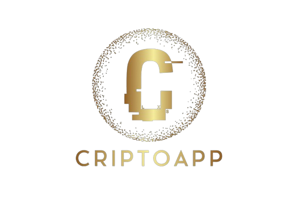

> [!NOTE]  
> This is a project created as the final project of CS50p: "Introduction to Python" by Carlos Nicolás González González.

# CriptoApp

CriptoApp is an application that encrypts and decrypts `.txt` documents using a new cryptography technology: `PBL Cryptography`. This technology allows the user to share and save sensitive information in a safe way.

### Table of Contents:

* [PBL Cryptography](#pbl-cryptography)
* [Project Description](#project-description)
* [Video Demo](#video-demo)
* [Developers](#developers)
* [Contact](#contact)

## PBL Cryptography
PBL Cryptography stands for "Password, Barcode, Length Cryptography." This is a new method used to generate cryptographic keys. To generate these keys, a password, a barcode, and the length of the document are required, making this key quite difficult, if not impossible, to hack.

The cryptographic key generated consists of a list of different number combinations. Depending on the length and complexity of the password and barcode, the number of different number combinations in that list increases, making the key even more difficult to hack.

Finally, the key is used by CriptoApp to encrypt and decrypt documents. How CriptoApp performs this process is explained in [Project Description](#how-criptoapp-uses-pbl-cryptography-keys).

## Project Description
CriptoApp is a program created with `Python 3.12` for Linux and Windows as a way to encrypt `.txt` documents using a new method of cryptography (`PBL Cryptography`) that uses a password, a barcode, and the length of the document to generate the cryptography key.

First, when entering the program, the first screen is a "log in" screen. This screen is designed to let the user have different accounts on the same device, or by connecting the program to an online database, have the same account on different devices. Using different accounts is useful if you want to store documents or keys separately from other users on the same device. However, this feature is not coded, so it is up to you to implement it (adding other extra functionalities if desired). To add the login feature, modify `login.py`.

After the login screen, there is the "menu screen," where you can select the mode you want to use: encrypt or decrypt.

Both the encrypt and decrypt modes are very similar. Both have a frame, which is a preview of the selected document (1), at the top of the screen; a document selector (2); a selector to choose where to save the new document generated after the encryption or decryption process (3); a password input field (4); a barcode input field (5), and a button on the right of the screen to start the process (6).

#### Barcode Scanner
The program has an integrated barcode scanner to make the barcode entry easier. To use this feature, press the `barcode` button (7) and use the webcam to scan the barcode you want to use.

#### Error Messages
When encrypting or decrypting your document, if you do not correctly fill in the fields, the program will display an error message. Follow the instructions and fill in the fields correctly to avoid problems.

> [!IMPORTANT]  
> Remember the password and the barcode used. Without them, it will be impossible to decrypt your document.

#### How CriptoApp Uses PBL Cryptography Keys:
CriptoApp encrypts the document by replacing each character with another. To replace the characters, CriptoApp uses the list of numerical combinations (the cryptography key generated with PBL Cryptography) and the UTF-8 number of the characters. With them, using a series of different mathematical operations, it replaces the characters, encrypting the message. This process is repeated several times (as many as the number of numeral combinations in the key) making it impossible to decrypt the message by predicting the characters based on the frequencies of different letters in the English alphabet.

While encrypting, CriptoApp stores some information hidden in the new document, such as the length of the document, to make it possible to generate the decryption key after encrypting.

This is a complex and tedious process to explain in text. If you want to understand better how this works, feel free to review the code and [contact me](#contact) if you have any questions or issues.

## Video Demo

#### Video demo: 

## Developer
This project has been created by Carlos Nicolás González González (GitHub user: lzeryx).

## Contact
If you want to understand better how the program works, feel free to review the code and contact me if you have any questions or issues.
#### Email: nicogggc1work@gmail.com

## Responsability

CriptoApp is not responsible for possible hacks or theft of information from encrypted documents. CriptoApp is an application that encrypts messages seeking the maximum possible security, but that does not mean that someone could decrypt your document maliciously. For this reason, as a user, it is your responsibility to ensure that this does not happen. CriptoApp encrypts documents in a way almost unhackable, but not imposible.
